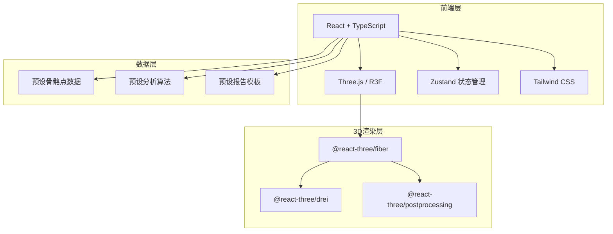

## 1. 架构设计



纯前端架构，无需后端服务。所有骨骼点数据、分析算法和报告模板均在前端预设。

## 2. 技术说明
- 前端框架：React@18 + TypeScript + Vite
- 初始化工具：vite-init (react-ts 模板)
- 3D渲染：three + @react-three/fiber + @react-three/drei + @react-three/postprocessing
- 状态管理：zustand
- 样式方案：tailwindcss@3
- 图表：recharts（用于报告页关节角度折线图）
- 无后端：全部使用前端预设数据和算法

## 3. 路由定义
| 路由 | 用途 |
|------|------|
| / | 首页 - 视频上传、3D模型渲染、帧控制、指标仪表盘 |
| /report | 分析报告页 - 问题摘要、角度图表、改进建议 |

## 4. API定义
无需后端API。所有数据通过前端预设模块提供：
- `src/data/poseData.ts`：预设骨骼关键点坐标数据（包含一个完整跑步周期的帧数据）
- `src/data/analysisData.ts`：预设分析结果数据（膝盖内扣、骨盆摇摆、前倾角度、步频步幅）
- `src/data/reportData.ts`：预设报告模板数据（问题列表、建议、训练动作）

## 5. 数据模型

### 5.1 骨骼点数据模型
```typescript
interface JointPosition {
  x: number;
  y: number;
  z: number;
}

interface PoseFrame {
  timestamp: number;
  joints: Record<string, JointPosition>;
  phase: "initial_contact" | "mid_stance" | "push_off" | "swing";
}

interface PoseData {
  frames: PoseFrame[];
  frameRate: number;
  totalFrames: number;
  jointNames: string[];
}
```

### 5.2 分析结果数据模型
```typescript
interface MetricResult {
  name: string;
  value: number;
  unit: string;
  status: "normal" | "warning" | "danger";
  referenceRange: [number, number];
  description: string;
}

interface PhaseAnalysis {
  phase: string;
  kneeAngle: number;
  hipAngle: number;
  ankleAngle: number;
  pelvicTilt: number;
  trunkLean: number;
}

interface AnalysisResult {
  metrics: MetricResult[];
  phases: PhaseAnalysis[];
  cadence: number;
  strideLength: number;
  overallScore: number;
}
```

### 5.3 报告数据模型
```typescript
interface Issue {
  id: string;
  title: string;
  severity: "normal" | "warning" | "danger";
  joint: string;
  description: string;
  angleDeviation: number;
}

interface TrainingAction {
  name: string;
  description: string;
  difficulty: "beginner" | "intermediate" | "advanced";
  targetIssue: string;
  steps: string[];
}

interface Report {
  issues: Issue[];
  trainingActions: TrainingAction[];
  angleTimeline: { time: number; kneeAngle: number; pelvicTilt: number; trunkLean: number }[];
  summary: string;
  overallScore: number;
}
```
